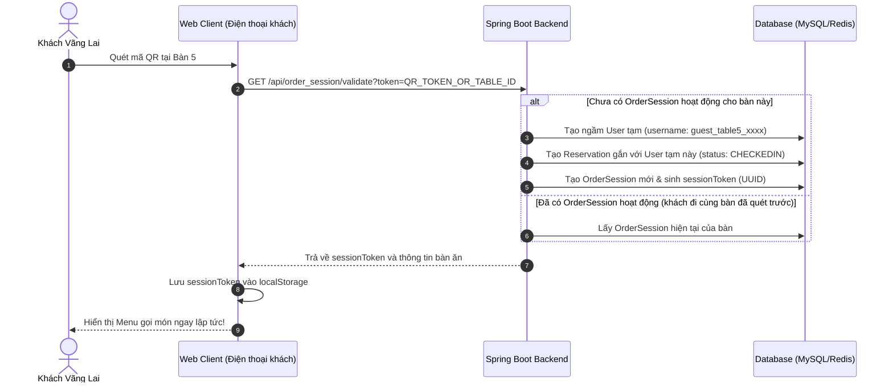

# Chiến Lược Thiết Kế Tính Năng Gọi Món Nhanh Qua Mã QR Cho Khách Vãng Lai (One-time/Walk-in Guest)

Tài liệu này phân tích mô hình vận hành gọi món tại bàn qua mã QR của các chuỗi nhà hàng lẩu lớn trên thế giới (như Haidilao, Manwah, Golden Gate) và đưa ra đề xuất giải pháp kỹ thuật tối ưu, sát với thực tế, dựa trên cấu trúc hiện tại của dự án **RestaurantApplication**.

---

## 1. Case Study & Thực Tế Vận Hành Tại Các Chuỗi Lớn

### A. Mô Hình Haidilao (Table-centric & Collaborative Session)
*   **Trải nghiệm khách hàng**: Khách đến được nhân viên dẫn vào bàn. Tại bàn đã dán sẵn một mã QR cố định hoặc nhân viên in một hoá đơn tạm có mã QR động riêng cho lượt ăn đó.
*   **Phương thức định danh**:
    *   **Bám vào bàn ăn (Table-centric)**: Hệ thống định danh phiên gọi món theo **Bàn ăn** kết hợp với **Token phiên (Session-based)** chứ không bắt buộc khách đăng ký tài khoản từ đầu.
    *   **Gọi món đồng thời (Collaborative Ordering)**: Mọi người trong cùng một bàn khi quét mã QR đều dùng chung một `sessionToken` (lưu ở `localStorage` trình duyệt). Họ đều nhìn thấy chung một giỏ hàng, người này thêm món thì màn hình người kia tự động cập nhật thời gian thực (real-time).
    *   **Thời điểm thu thập thông tin**: Haidilao chỉ hỏi Số điện thoại (SĐT) ở 2 thời điểm và đều **cho phép bỏ qua (optional)**:
        1. *Khi quét mã vào menu*: *"Bạn có muốn nhập SĐT để tích điểm thành viên và nhận ưu đãi hôm nay?"* -> Nhấn "Bỏ qua" để vào thẳng menu với tư cách "Khách vãng lai".
        2. *Khi thanh toán*: Thu ngân hỏi SĐT để áp dụng voucher hoặc tích điểm trực tiếp trên máy POS.

### B. Mô Hình Manwah (Golden Gate - The Golden Spoon)
*   **Trải nghiệm khách hàng**: Khách quét mã QR dán tại bàn để tự phục vụ gọi món nhanh.
*   **Phương thức định danh**:
    *   Hệ thống yêu cầu nhập nhanh SĐT để nhận diện ưu đãi thành viên.
    *   **Tối giản bước đăng ký**: Nếu SĐT chưa tồn tại, hệ thống tự động tạo tài khoản ngầm (Shadow Account) mà không bắt nhập mật khẩu, OTP hay email rườm rà.
    *   **Tuỳ chọn Khách vãng lai**: Luôn có nút *"Tiếp tục với tư cách khách vãng lai"* để loại bỏ hoàn toàn ma sát (friction), giúp khách hàng tiếp cận menu chỉ sau 1 lượt chạm.

---

## 2. Phân Tích Hiện Trạng Codebase dự án **RestaurantApplication**

Hiện tại, hệ thống của bạn đang quản lý luồng gọi món tại bàn thông qua:
1.  **[Reservation.java](file:///d:/Study/PTHTWeb/DoAn/RestaurantQueue/RestaurantApplication/RestaurantApplication/src/main/java/com/tth/RestaurantApplication/entity/Reservation.java)**: Đại diện cho lượt khách ngồi tại bàn.
    *   *Rào cản*: Thuộc tính `user` đang cấu hình `@JoinColumn(name = "user_id", nullable = false)`. Nghĩa là mọi lượt bàn ăn đều **bắt buộc phải gắn với một User cụ thể** trong DB.
2.  **[User.java](file:///d:/Study/PTHTWeb/DoAn/RestaurantQueue/RestaurantApplication/RestaurantApplication/src/main/java/com/tth/RestaurantApplication/entity/User.java)**: Có các trường `username`, `email` được đánh dấu `nullable = false` và `unique = true`.
3.  **[OrderSession.java](file:///d:/Study/PTHTWeb/DoAn/RestaurantQueue/RestaurantApplication/RestaurantApplication/src/main/java/com/tth/RestaurantApplication/entity/OrderSession.java)**: Chứa `sessionToken` để định danh phiên gọi món và kiểm tra thời hạn hiệu lực (`expiredAt`).
4.  **[OrderSessionController.java](file:///d:/Study/PTHTWeb/DoAn/RestaurantQueue/RestaurantApplication/RestaurantApplication/src/main/java/com/tth/RestaurantApplication/controller/OrderSessionController.java)**: Khi lấy thông tin thanh toán hay kiểm tra voucher, code đang tự động lấy `User` của Reservation:
    ```java
    User customer = order.getOrderSession().getReservation().getUser();
    ```

> [!IMPORTANT]
> **Nút thắt cần giải quyết**: Làm sao để tạo ra một `OrderSession` và `Reservation` hợp lệ cho khách vãng lai quét QR tại chỗ mà **không bắt họ phải tải app, đăng ký tài khoản, nhập mật khẩu hay xác thực email**, đồng thời không phá vỡ tính toàn vẹn dữ liệu (Data Integrity) hiện tại.

---

## 3. Đề Xuất 2 Phương Án Giải Quyết Kỹ Thuật

Sau đây là 2 phương án kỹ thuật sát sườn với dự án của bạn để giải quyết bài toán định danh khách vãng lai.

### PHƯƠNG ÁN 1: Tài Khoản Khách Tạm Thời Tự Động (Shadow Guest Account)
*Đây là phương án tối ưu nhất, thực tế nhất và KHÔNG cần thay đổi cấu trúc Database hiện tại.*



#### Cách thức vận hành chi tiết:
1.  **Nhận diện qua mã QR**: Mỗi bàn ăn có một mã QR chứa đường link dạng: `https://nhahang.com/order?tableId=5` (hoặc nhân viên quét mã mở bàn trên máy tính bảng để kích hoạt bàn).
2.  **Tự động khởi tạo phiên**: Khi khách quét mã QR:
    *   Hệ thống gọi API `POST /api/order_session/quick-start?tableId=5`
    *   Backend kiểm tra xem bàn số 5 có `Reservation` nào đang ở trạng thái `CHECKEDIN` và `OrderSession` đang hoạt động (`isActive = true`) hay không.
    *   **Nếu CHƯA CÓ**:
        *   Backend tự động tạo một dòng dữ liệu `User` tạm thời (Shadow Guest User) trong DB:
            *   `fullName` = `"Khách Vãng Lai Bàn 5"`
            *   `username` = `"guest_t5_" + UUID.randomUUID().toString().substring(0, 8)`
            *   `email` = `"guest_t5_" + System.currentTimeMillis() + "@guest.restaurant.com"` (để thoả mãn thuộc tính `unique` và `not null`).
            *   `role` = `Role.CUSTOMER`
            *   `membershipTier` = `NORMAL` (hoặc hạng thấp nhất để lấy `priorityScore` mặc định = 1).
        *   Tiếp theo, tạo `Reservation` cho `tableId = 5` gắn với `User` tạm vừa tạo, đặt `status = CHECKEDIN`.
        *   Tạo `OrderSession` với `sessionToken` (UUID) và `Order` tương ứng.
    *   **Nếu ĐÃ CÓ** (Trường hợp đi đông người, người thứ 2 quét mã QR của bàn đó):
        *   Backend trả về ngay `sessionToken` của `OrderSession` đang hoạt động của bàn đó. Cả bàn sẽ dùng chung một giỏ hàng thời gian thực!
3.  **Lưu phiên ở Client**: Điện thoại của khách lưu `sessionToken` vào `localStorage` hoặc `Cookie` để định danh trong suốt quá trình ăn uống. Khi gọi món (`createOrderItem`), hệ thống tự động nhận diện thông qua `sessionId` và gửi món vào bếp.
4.  **Tùy chọn nâng cấp thành viên (Loyalty Conversion)**:
    *   Trên giao diện gọi món của khách, thiết kế một nút nhỏ nổi bật: *"Đăng ký thành viên để được giảm 5% và tích điểm cho bữa ăn này"*.
    *   Nếu khách click và nhập SĐT: Hệ thống sẽ cập nhật thông tin tài khoản tạm thời kia (cập nhật `fullName`, `phone`, `email` thực) hoặc gộp giỏ hàng vào tài khoản thực có sẵn của khách. Đây là cách Haidilao và Manwah thu hút khách hàng trung thành rất hiệu quả!
5.  **Dọn dẹp Database (Cron Job)**:
    *   Các tài khoản khách tạm này sau khi thanh toán xong (`Reservation` chuyển thành `CHECKEDOUT`) sẽ không bao giờ đăng nhập lại.
    *   Bạn có thể chạy một tác vụ ngầm định kỳ hàng tuần/hàng tháng để dọn dẹp các tài khoản `User` bắt đầu bằng `guest_` mà không có giao dịch phát sinh mới, giúp tối ưu dung lượng DB.

*   **Đánh giá độ khả thi**: **10/10** - Cực kỳ dễ triển khai, hoàn toàn tương thích với code logic hiện tại của bạn, không lo lỗi `NullPointerException` ở bất kỳ API nào cần thông tin `User`.

---

### PHƯƠNG ÁN 2: Thiết Kế Định Danh Theo Phiên Bàn Ăn (Table-centric Session)
*Phương án này sửa đổi Database để chuyển mối quan hệ chặt chẽ từ User-centric sang Table-centric.*

#### Cách thức vận hành chi tiết:
1.  **Sửa đổi cơ sở dữ liệu**:
    *   Chuyển trường `user_id` trong bảng `Reservation` thành **`nullable = true`**.
2.  **Logic gọi món**:
    *   Khi khách vãng lai quét mã QR dán tại bàn để vào menu, hệ thống tạo `Reservation` với `user_id = null`.
    *   Hệ thống định danh khách hàng hoàn toàn bằng `sessionToken` của `OrderSession`.
    *   Khi tính toán các logic liên quan đến `User` (ví dụ như lấy `priorityScore` cho món ăn trong [OrderItemService.java](file:///d:/Study/PTHTWeb/DoAn/RestaurantQueue/RestaurantApplication/RestaurantApplication/src/main/java/com/tth/RestaurantApplication/service/OrderItemService.java)):
        ```java
        // Kiểm tra null an toàn trước khi lấy priority
        Integer priority = 1;
        if (order.getOrderSession() != null && 
            order.getOrderSession().getReservation() != null && 
            order.getOrderSession().getReservation().getUser() != null && // 👈 Check null user
            order.getOrderSession().getReservation().getUser().getMembershipTier() != null) {
            priority = order.getOrderSession().getReservation().getUser().getMembershipTier().getPriority();
        }
        ```
3.  **Thanh toán**:
    *   Lúc tính tiền, nếu khách vãng lai không có thẻ thành viên, hệ thống tạo hoá đơn (`Bill`) với `customer = null`.

*   **Đánh giá độ khả thi**: **7/10** - Luồng dữ liệu chuẩn chỉ về mặt thiết kế (không tạo tài khoản rác). Tuy nhiên, **tốn nhiều công sức bảo trì và sửa đổi code hiện tại**, vì hầu hết các Service và DTO của bạn hiện nay đang ngầm định rằng `Reservation` và `Order` luôn luôn có một `User` đi kèm (nếu không check null kỹ sẽ rất dễ gây lỗi crash hệ thống).

---

## 4. Kịch Bản Trải Nghiệm Khách Hàng Lý Tưởng (User Story)

Để bạn dễ dàng hình dung và trình bày với các bên liên quan, đây là hành trình khách hàng được thiết kế theo chuẩn PO:

1.  **Bước 1: Tiếp cận & Quét mã**
    *   Khách hàng (anh Minh) bước vào nhà hàng lẩu, được nhân viên sắp xếp ngồi tại **Bàn số 8**.
    *   Anh Minh dùng điện thoại quét mã QR được dán sẵn trên bàn.
2.  **Bước 2: Vào menu gọi món ngay lập tức**
    *   Trình duyệt điện thoại mở ra trang web gọi món của nhà hàng. Hệ thống nhận diện Bàn số 8 chưa có phiên ăn nào, lập tức chạy ngầm luồng tạo **Shadow Guest Account** và mở một **OrderSession** cho Bàn 8.
    *   Trang web hiển thị giao diện chào mừng: `"Chào mừng quý khách đến với nhà hàng - Bàn số 8"`. Không yêu cầu đăng nhập, không yêu cầu điền thông tin cá nhân.
3.  **Bước 3: Cả bàn cùng gọi món (Collaborative Shopping Cart)**
    *   Vợ anh Minh ngồi đối diện cũng quét mã QR Bàn 8. Điện thoại của chị lập tức đồng bộ và kết nối chung vào `OrderSession` của anh Minh.
    *   Anh Minh thêm *Lẩu nấm*, chị thêm *Ba chỉ bò*. Cả hai đều nhìn thấy giỏ hàng cập nhật thời gian thực trên màn hình điện thoại của mình.
4.  **Bước 4: Trải nghiệm ăn uống & Xem trạng thái phục vụ**
    *   Anh Minh bấm nút **"Gửi yêu cầu Bếp"**.
    *   Món ăn được chuyển vào giao diện của Đầu bếp với độ ưu tiên mặc định là `1` (Khách vãng lai).
    *   Màn hình điện thoại của anh Minh hiển thị trạng thái chuẩn bị món và thời gian chờ dự kiến (real-time tracking nhờ Firestore tích hợp sẵn trong hệ thống của bạn).
5.  **Bước 5: Gọi thanh toán tiện lợi**
    *   Ăn xong, anh Minh ấn nút **"Yêu cầu thanh toán"** trên điện thoại.
    *   Hệ thống khóa bàn để chuẩn bị thanh toán (Tránh trường hợp gọi thêm món khi đang làm bill).
    *   Anh Minh có thể chọn thanh toán online qua **VNPAY** ngay trên điện thoại hoặc gọi nhân viên lại bàn thanh toán tiền mặt/quẹt thẻ.
    *   Sau khi thanh toán thành công, `OrderSession` kết thúc, Bàn số 8 được giải phóng để sẵn sàng đón lượt khách tiếp theo.

---

## 5. Kế Hoạch Triển Khai Kỹ Thuật (Cho Phương Án 1 - Đề Xuất Tối Ưu)

Nếu bạn lựa chọn **Phương án 1 (Shadow Guest Account)**, dưới đây là các bước chỉnh sửa code cụ thể cần thực hiện:

### Bước 1: Bổ sung API tạo phiên nhanh trong `OrderSessionController.java`
Tạo một endpoint mới để hỗ trợ Client quét mã QR khởi tạo phiên ăn ngay lập tức:
```java
@PostMapping("/quick-start")
public ApiResponse<OrderSessionResponse> quickStartSession(@RequestParam("tableId") Integer tableId) {
    return ApiResponse.<OrderSessionResponse>builder()
            .result(orderSessionService.createQuickGuestSession(tableId))
            .message("Quick guest session started successfully")
            .build();
}
```

### Bước 2: Viết logic tạo tài khoản ngầm và session trong `OrderSessionService.java`
```java
@Transactional
public OrderSessionResponse createQuickGuestSession(Integer tableId) {
    log.info("Starting quick guest session for tableId={}", tableId);
    
    // 1. Tìm bàn ăn
    TableEntity table = tableRepository.findById(tableId)
            .orElseThrow(() -> new AppException(ErrorCode.TABLE_NOT_FOUND));
            
    // 2. Kiểm tra xem bàn này đã có Reservation hoạt động (CHECKEDIN) chưa
    Optional<Reservation> activeResOpt = reservationRepository
            .findByTableAndStatus(table, Reservation.ReservationStatus.CHECKEDIN);
            
    Reservation reservation;
    if (activeResOpt.isPresent()) {
        // Nếu đã có phiên hoạt động (do người đi cùng bàn đã quét trước đó)
        reservation = activeResOpt.get();
        log.info("Active reservation found for tableId={}, joining existing session", tableId);
    } else {
        // Nếu chưa có, tiến hành tạo mới hoàn toàn
        log.info("No active reservation found. Creating shadow guest user...");
        
        // 2a. Tạo shadow user
        String uniqueSuffix = UUID.randomUUID().toString().substring(0, 8);
        User guestUser = User.builder()
                .fullName("Khách Bàn " + table.getTableName())
                .username("guest_" + tableId + "_" + uniqueSuffix)
                .email("guest_" + tableId + "_" + System.currentTimeMillis() + "@guest.restaurant.com")
                .role(User.Role.CUSTOMER)
                .build();
        userRepository.save(guestUser);
        
        // 2b. Tạo reservation dạng CHECKEDIN
        reservation = new Reservation();
        reservation.setUser(guestUser);
        reservation.setTable(table);
        reservation.setBookingTime(LocalDateTime.now());
        reservation.setCheckinTime(LocalDateTime.now());
        reservation.setStatus(Reservation.ReservationStatus.CHECKEDIN);
        reservationRepository.save(reservation);
        
        // 2c. Tạo OrderSession & Order thông qua OrderManagementService
        OrderSession newSession = orderManagementService.createInHouseOrderFromReservation(reservation);
        reservation.setOrderSession(newSession);
        reservationRepository.save(reservation);
        
        // Cập nhật trạng thái bàn thành OCCUPIED
        table.setStatus(TableEntity.TableStatus.OCCUPIED);
        tableRepository.save(table);
    }
    
    // 3. Trả về thông tin session tương thích
    OrderSession orderSession = reservation.getOrderSession();
    OrderSessionResponse response = orderSessionMapper.toOrderSessionResponse(orderSession);
    response.setReservationResponse(reservationMapper.toReservationResponse(reservation));
    response.setValid(true);
    
    return response;
}
```

---

## Kết Luận & Đề Xuất Từ PO
Phương án **Shadow Guest Account (Tạo tài khoản khách tạm tự động)** là giải pháp hoàn hảo và sát thực tế nhất. Nó đáp ứng hoàn toàn trải nghiệm gọi món siêu tốc kiểu **Haidilao/Manwah**, đồng thời giúp bạn tận dụng **100% cấu trúc logic nghiệp vụ sẵn có** trong mã nguồn hiện tại mà không phải đập đi xây lại hay lo lắng về các lỗi tiềm ẩn do cấu trúc dữ liệu bị trống (`null`).

Hãy cho mình biết suy nghĩ của bạn về đề xuất này nhé! Mình rất sẵn lòng hỗ trợ bạn viết chi tiết code triển khai hoặc thảo luận sâu hơn về thiết kế giao diện gọi món.
