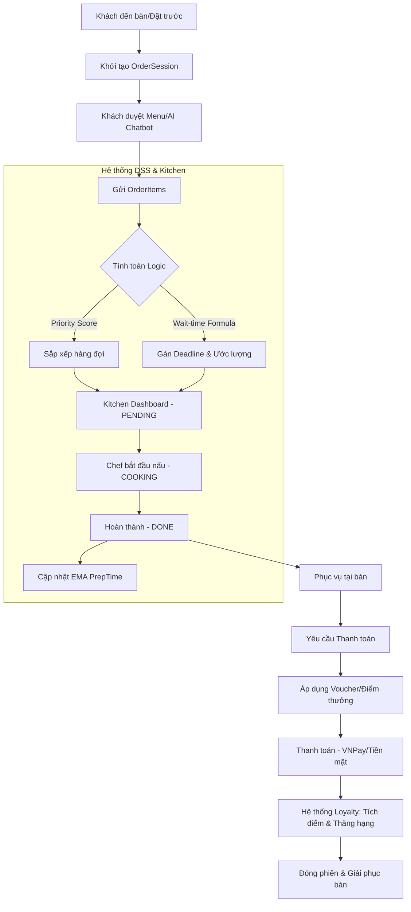

# Tổng Quan Hệ Thống Restaurant Management

Tài liệu này tổng hợp các module quan trọng và quy trình nghiệp vụ chính của hệ thống quản lý nhà hàng.

## 1. Các Module Quan Trọng

Hệ thống được thiết kế theo kiến trúc hiện đại, tập trung vào trải nghiệm khách hàng và tối ưu hóa vận hành bếp.

### 🔐 Security & Identity (Bảo mật & Định danh)
- Quản lý người dùng, phân quyền (Admin, Chef, Customer).
- Xác thực dựa trên JWT (JSON Web Token).
- Quản lý thông tin cá nhân và hạng thành viên.

### 📋 Menu & Category Management (Quản lý Thực đơn)
- Quản lý danh mục món ăn và chi tiết món ăn (tên, giá, mô tả, ảnh).
- **Vector Search**: Tích hợp Redis Vector DB và Gemini AI để tìm kiếm món ăn thông minh theo ngữ nghĩa.

### 🔄 Real-time Synchronization (Đồng bộ Real-time)
- Sử dụng **Firebase Firestore** làm trung tâm điều phối dữ liệu thực tế.
- Mọi thay đổi trạng thái món ăn (Bếp đang nấu, đã xong) hoặc yêu cầu từ khách (Gọi thanh toán) đều được đẩy tức thời lên Dashboard của Bếp và Tablet của Quản lý.

### 🍱 Order & Session Management (Hàng đợi & Phiên order)
- **OrderSession**: Quản lý phiên gọi món theo từng bàn.
- Phân tách rõ ràng giữa `DINE_IN` (Tại chỗ) và `ONLINE` (Giao hàng).

### 👨‍🍳 Kitchen Queue DSS (Hệ thống Hàng đợi Bếp thông minh)
Đây là "trái tim" của hệ thống, hỗ trợ ra quyết định (DSS):
- **Priority Queue**: Tự động sắp xếp thứ tự nấu dựa trên hạng thành viên (VIP phục vụ trước) và mốc Deadline.
- **Wait-time Estimation**: Công thức tính toán thời gian chờ thực tế dựa trên năng suất bếp hiện tại.
- **EMA Algorithm**: Cập nhật thời gian nấu trung bình của từng món ăn sau khi hoàn thành để tăng độ chính xác cho lần sau.

### 🎖️ Membership & Loyalty (Thành viên & Khách hàng thân thiết)
- Tích điểm dựa trên chi tiêu.
- Phân tầng hạng (Gold, Silver, New Member) với các quyền ưu tiên phục vụ khác nhau.
- Tự động thăng hạng và tặng voucher khi đạt ngưỡng chi tiêu.

### 💳 Payment & Billing (Thanh toán & Hóa đơn)
- Tích hợp cổng thanh toán trực tuyến **VNPay**.
- Quản lý Voucher và tính toán giảm giá.
- Xuất hóa đơn và lưu trữ lịch sử giao dịch.

### 🤖 AI Chatbot
- Hỗ trợ khách hàng đặt món.
- Tư vấn món ăn dựa trên sở thích và dữ liệu Vector Search.
- Điều phối tải (Load Balancing) bằng cách gợi ý các món nấu nhanh khi bếp đang quá tải.

---

## 2. Quy trình Order DINE_IN (Tại nhà hàng)

Quy trình `DINE_IN` được thiết kế khép kín để đảm bảo tính công bằng và hiệu quả vận hành.

### Chi tiết các bước chính:

1.  **Khởi tạo**: Khi khách có mặt, một `OrderSession` được kích hoạt gắn liền với `Reservation`. Khách quét mã hoặc nhận tablet để bắt đầu.
2.  **Đặt món (Ordering)**: 
    - Khi khách chọn món, hệ thống lấy `priority` từ hạng thành viên của khách.
    - Áp dụng công thức: $T_{wait} = Max(Remaining_{cooking}) + \frac{\sum Pending_{load}}{Capacity_{kitchen}} + T_{self}$ để báo cho khách thời gian chờ dự kiến.
    - Gán một `deadlineTime` (mốc giờ cần phải xong) để bếp theo dõi.
3.  **Xử lý tại Bếp**:
    - Món ăn hiện lên màn hình của Chef theo thứ tự ưu tiên (Ưu tiên hạng cao + Món sắp trễ deadline).
    - Trạng thái được cập nhật real-time về điện thoại của khách qua Firestore.
4.  **Học máy (Learning loop)**: Khi Chef nhấn "Xong", hệ thống ghi lại thời gian nấu thực tế và dùng thuật toán **EMA (Exponential Moving Average)** để cập nhật lại `avgCookingTime` của món đó trong database.
5.  **Thanh toán & Loyalty**:
    - Khách có thể thanh toán trực tiếp qua VNPay trên App.
    - Ngay sau khi thanh toán thành công, hệ thống tự động cộng dồn chi tiêu, tính điểm thưởng và kiểm tra nếu khách đủ điều kiện thăng hạng thì sẽ tặng Voucher phần thưởng ngay lập tức.
